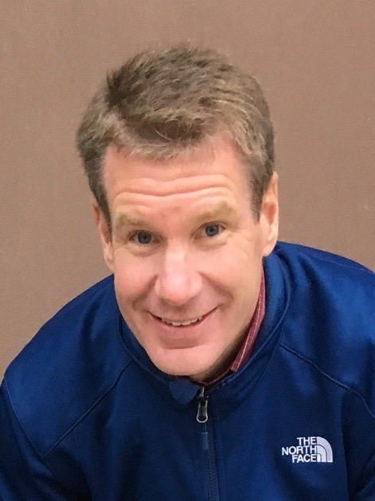

# Oral Assessments: Building a Community of Statistical Thinkers and Speakers

[USCOTS 2021](https://www.causeweb.org/cause/uscots/uscots21/4f-oral-assessments-building-community-statistical-thinkers-and-speakers)  
Thursday, July 1st, 2021  
1:15 pm – 2:30 pm ET 

---

### 💻 : Slides

- [Allison's Slides](https://atheobold.github.io/oral-exams-uscots/slides/oral_exams.html)

- [Paul's Slides]()

### 📖 : Additional Resources

- [Allison's JSE (Brief) Commentary](https://www.tandfonline.com/doi/full/10.1080/26939169.2021.1914527)

- [Paul and Kelly McConville's *Ask Good Questions* Post](https://askgoodquestions.blog/2021/02/08/84-giving-oral-exams/)

- [Holistic Rubric for Mastery Based Grading](https://atheobold.github.io/oral-exams-uscots/resources/rubric.pdf)

---

## Abstract

Oral assessments provide educators with a wealth of information about student understanding. Rather than deciphering a static written response, oral assessments allow instructors to probe student understanding, providing a more complete picture of their overall understanding. However, the potential time and energy required to incorporate oral assessments in the classroom, combined with the fear of the unknown, may cause many educators to shy away. This session will (1) break down barriers for instructors interested in incorporating oral assessments in their classrooms, and (2) help instructors design oral assessments for a specific course.

During this session, we will first share two different perspectives on designing and administering oral assessments, one as a follow-up to a homework assignment and the other as a midterm or final exam. We will then outline the components that are instrumental to creating meaningful oral assessments (e.g., design, facilitation, grading), the approach we took for each component, and recommendations we would offer.

Throughout the session participants will consider how they might apply ideas being discussed to an assessment setting from their own teaching, receiving feedback on their ideas from fellow attendees. By the end of the session, participants will (1) see that oral assessments carry many potential benefits for a reasonable level of costs, and (2) have created an outline for how they might administer an oral assessment in one of their own courses.

## Instructors

[**Allison Theobold**](https://statistics.calpoly.edu/allison-theobold) (California Polytechnic University) is and Assistant Professor in the Department of Statistics at Cal Poly in beautiful San Luis Obispo, California. Allison's work focuses on innovation in statistics and data science education, with an emphasis on equitable pedagogy, computing, and reproducible research. Allison is also interested in exploring pedagogical approaches for enhancing retention of under-represented students in STEM, including creating inclusive discoursive spaces and equitable group collaborations. 

Allison is actively involved in the Carpentries community, both as a certified instructor and curriculum maintainer. 

[**Paul Roback**]() (St. Olaf College) is the Kenneth O. Bjork Distinguished Professor of Statistics and Data Science and Director of the Center for Interdisciplinary Research at St. Olaf College in Northfield, Minnesota.  Paul recently completed the book [Beyond Multiple Linear Regression: Applied Generalized Linear Models and Multilevel Models in R](https://bookdown.org/roback/bookdown-BeyondMLR/) with Julie Legler.  Paul is the past Chair of the ASA Section on Statistical and Data Science Education, conducts applied research using multilevel modeling, text analysis, and Bayesian methods, and has been a statistical consultant in the pharmaceutical, health care, and food processing industries. 
is a Kenneth Bjork Distinguished Professor of Mathematics, Statistics, and Computer Science and Director of the Center for Interdisciplinary Research at St. Olaf College. 
